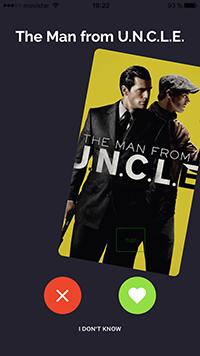

 

# SPOT A MOVIE

# React Native  App [IOS]

## Description

How long do you spend looking for a movie rather than actually watching a movie?
Our app solves that problem for you!
Spot A Movie is a mobile app, developed in React Native that allows users to connect with their Spotify accounts, and get movie recommendations based on their Spotify playlists.

## Installation

* Clone this repo.
* Run `npm install`.
* Ensure a device, or emulated IOS  is connected .
* Run `react-native run-ios`.

## Can I use this as a base project?

Of course. Please remember though it is not a "fit all" solution and you'll need to configure it for your own project needs.

## How it works

This IOS only demo app has been designed to be as minimal and basic as possible, to avoid confusion.

Key points:
- It's only working on IOS for now.
- Main entry point is  `./index.ios.js`, from there scenes are located in  `./app/container/appcontainer.js`,  

## Tests

The  tests are running using [Jest](https://facebook.github.io/jest/). 
and continuos integration on [Travis](https://travis-ci.org/johnandblue/spotamovieFE)
To run tests: `npm test`

## Tech Stack

**Main Framework**: [React Native](https://github.com/facebook/react-native) / [Redux](https://github.com/reactjs/redux)

**Libraries**: [Nachos-ui](https://github.com/avocode/nachos-ui), [Swiper](https://github.com/meteor-factory/react-native-tinder-swipe-cards), [react-native-router-flux](https://github.com/aksonov/react-native-router-flux), [vector icons](https://github.com/oblador/react-native-vector-icons), [react-native-spotify](https://github.com/viestat/react-native-spotify)

**Server**: [spotamovie-be](https://github.com/miguelgimenezgimenez/spotamovie-be)

**Testing**: [Jest](https://github.com/facebook/jest)

**Continous Integration**: [Travis CI](travis-ci.org)

## Server

There is a server for that the app running in another repository:
To install it and use it follow the instructions here: [spotamovie-be](https://github.com/miguelgimenezgimenez/spotamovie-be)

## Contribuitors

Team effort by:

https://github.com/2rod

https://github.com/miguelgimenezgimenez/

https://github.com/vavarun

https://github.com/johnandblue/

## License

MIT
